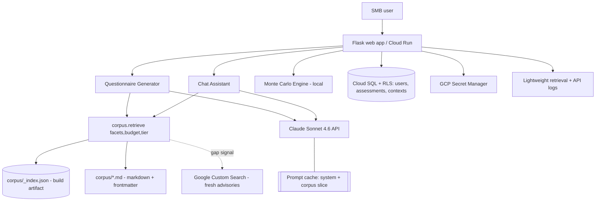

# OIC-DESIGN-2026-001: OpenImpactCascade — End-to-End Design & Re-Grounding Brief

| Field | Value |
|-------|-------|
| **Status** | Living document — review and amend before handing to a coding agent |
| **Date** | 2026-05-31 |
| **Owner** | D. Leece |
| **Primary purpose** | (1) Re-ground the owner after a 4–6 month gap; (2) serve as the authoritative brief a coding agent works from |
| **Companion docs** | `ADR-0012` (retrieval architecture), `OIC-DD-2026-003` (5-category likelihood scale) |

> **How to use this doc.** Read §2 (current state) and §16 (open decisions) first to reload context. Edit anything that's wrong — *your* corrections are the regrounding. Then §17 is the literal instruction set for the coding agent. Nothing here should be implemented before you've reviewed it; treat §16 as blocking.

---

## 1. Product Overview, Goals & Non-Goals

**What OIC is:** a freemium SaaS that helps small/medium businesses quantify cyber risk using FAIR (Factor Analysis of Information Risk) — AI-generated questionnaires, grounded in a curated corpus, feeding a Monte Carlo simulation that produces defensible loss distributions instead of "high/medium/low" hand-waving.

**The wedge:** SMBs today either buy enterprise RQ tools they can't afford/operate, or paste data into ChatGPT/Gemini and get official-sounding prose with no math, no grounding, and no auditability. OIC is the affordable, *defensible* middle: real probabilistic modeling + transparent authoritative sources.

**Goals**
- Defensible quantitative output (FAIR + Monte Carlo), not generated narrative.
- Grounding that is **traceable** (every estimate points to a readable source).
- Freemium economics that survive a large free tier (low marginal cost per interaction).
- Forward-looking, vendor-portable architecture maintainable by one person intermittently.

**Non-Goals (now)**
- Not a compliance/audit-evidence tool (compliance ≠ security; SOC 2 is a signal, not assurance).
- Not multi-domain yet (cyber first; physical/operational risk reserved via domain-agnostic base classes).
- Not real-time/agentic threat hunting.
- The conference is a **deadline forcing function**, not a deliverable spec. Don't trade durable architecture for demo theatrics.

---

## 2. Current State Snapshot (honest re-grounding)

**What works / is in the repo (`dleecefft/OIC_SBX`):**
- Flask app on Cloud Run; two entrypoints exist — `app/flask_oic_v215.py` (README says "main") and `app/flask_oic_v221.py` (larger; the one with a compiled `.pyc`). **Ambiguous — must resolve which is canonical.**
- `ai_question_generator_v221.py` — questionnaire generation w/ RAG + Google Custom Search gap-fill.
- `simulation_v211.py` — Monte Carlo (PERT + lognormal).
- `vertex_rag_v211.py` — Vertex AI RAG integration (**to be replaced per ADR-0012**).
- `user_tracking.py` — hashed user IDs + API-call logging (safeguards).
- `context_storage.py` + `assessment_contexts.db` — SQLite assessment-context storage.
- ~65 markdown docs, mostly AI-session artifacts in `documentation/`.

**Known debt (blocks "good POC"):**
- Two Flask versions; README points at the wrong/older one.
- Committed artifacts: `__pycache__/*.pyc` (incl. one for a deleted `flask_app_chat_v2_rag.py`), empty `assessment_contexts.db`, `removeme.txt` placeholders. **No root `.gitignore`.**
- `README_bq-rag.md` documents a `tools/bq_rag_ingest` pipeline that **isn't in the repo**.
- Model string is `claude-sonnet-4-20250514` (a generation behind) in ~10 places.
- Four `gcs_to_rag_upload_*.py` variants + `tools/_archive_/`.
- Documentation sprawl (~40 files in `documentation/`).

**Verified-safe:** the committed `.db` is empty (0 rows); no real API keys committed (README/terraform matches are placeholders / generated-key references). Still remove the `.db` from tracking.

---

## 3. System Architecture



**Component summary**
- **Flask app (Cloud Run):** request handling, session, tier enforcement, orchestration.
- **Retrieval (`corpus/`):** replaces Vertex RAG. Filters `_index.json` by facets, assembles a cached context slice from markdown bodies (see ADR-0012).
- **LLM (Claude Sonnet 4.6, `claude-sonnet-4-6`):** generation + chat. System prompt and corpus slice cached.
- **Monte Carlo engine (local NumPy/SciPy):** no API cost; deterministic given a seed.
- **Web search (Google Custom Search):** triggered only by corpus-gap / high-`freshness_sensitivity` signals; results are uncached.
- **Persistence (Cloud SQL + RLS):** users, assessments, saved contexts; Row-Level Security for tenant isolation. (Migrate `context_storage.py`/SQLite into this, or keep SQLite only for local dev.)
- **Secret Manager:** all credentials; nothing in env files in prod.

---

## 4. Knowledge / Retrieval Subsystem

Governed entirely by **ADR-0012**. Summary of the contract the rest of the system depends on:

```python
retrieve(facets: Facets, budget: int = 150_000, tier: str = "free") -> ContextSlice
# Facets: industry, region, scenario_tags?, domains?, fair_components?
# ContextSlice: ordered docs (body text), total_tokens, citations_manifest, gap_flag
```

- Default path: metadata filter → deterministic score (`quality_rating × priority_weight` + scenario/MITRE/FAIR-component bonuses) → greedy budget fit.
- `gap_flag` true ⇒ caller may invoke web search.
- Citations manifest maps each included doc to `id` + section anchors for the model to cite.
- Vector/agentic extensions are future and additive (ADR-0012 §7).

---

## 5. FAIR Quantification Engine

The defensible core. **This is what you lead with**, not the retrieval plumbing.

### 5.1 Decomposition
```
LEF = TEF × Vulnerability
Risk (per scenario) = LEF × Loss Magnitude
```
- **TEF** (Threat Event Frequency): attempted attacks/year. Grounded in threat intel (CISA/CCCS, scenario profiles).
- **Vulnerability**: P(attempt succeeds), 0–1, from control-maturity lookup (Minimal 70% → Basic 40% → Intermediate 15% → Advanced 5%).
- **LEF**: derived, successful loss events/year.
- **Loss Magnitude**: financial impact per successful event.

### 5.2 Distributions (decision already made — keep)
- **Loss Magnitude → Lognormal** (captures catastrophic tails; PERT underestimates them; aligns w/ cyber-insurance practice).
- **Bounded three-point estimates → PERT** (min / most-likely / max) for component elicitation.
- **Discrete frequency → optionally Poisson** for event counts.
- Monte Carlo ≥ 10,000 iterations; report mean (ALE), percentiles (esp. P90), and the distribution.

### 5.3 Likelihood elicitation — IN FLIGHT (see OIC-DD-2026-003)
Migration 3-category → **5-category ordinal scale**, grounded in Hashim 2024 / IPCC AR5 / ICD-203:
- Five categories with confidence-interval widening on the PERT params.
- **"Medium" recentered at ~40%** (empirical "possible"), not naive 50%.
- An **"uncertain"** option using a **max-entropy uniform** distribution, with sensitivity analysis flagging it to prioritize research.
- Behind a **feature flag**; comparative testing vs the 3-category baseline.
> **Coding-agent note:** the questionnaire generator and simulation both consume the likelihood scale. Implement the 5-category scale *only* per OIC-DD-2026-003, gated by flag. Do not silently change defaults.

### 5.4 Determinism for demos & tests
Expose a `seed` parameter; a fixed seed yields reproducible distributions. Required for a stable demo/sales walkthrough and for snapshot tests.

---

## 6. Questionnaire Generation Flow
1. User picks **industry + region** (+ optional scenario/size).
2. `retrieve(facets, tier)` builds the cached corpus slice.
3. If `gap_flag` or any included doc is `freshness_sensitivity: high`, run a bounded Google Custom Search and append fresh advisories (uncached).
4. Call Claude Sonnet 4.6 with: cached system/methodology block + cached corpus slice + dynamic instruction; request **structured JSON** questionnaire with PERT three-point fields per FAIR component and **inline citations** (doc `id`).
5. Validate JSON (retry ≤3 with tightened params); persist to Cloud SQL.
6. Present with rationale + source links (auditability surface).

---

## 7. Chat Assistance Flow
- Context-aware help per question; reuses the same cached slice + methodology block.
- Conversation history in the uncached dynamic block.
- **Optional future:** agentic file-read tool letting the model request an additional corpus doc by `id` for deep questions (the ADR-0012 evolution path) — keep behind a flag.

---

## 8. Web Search Gap-Filling
- **RAG informs; web search enhances — never duplicates.** Search only when the corpus is thin (`gap_flag`) or content is freshness-sensitive.
- Smart query generation derived from facets + detected gap.
- Results are time-stamped, cited distinctly from corpus sources, and **not** cached.
- Keep call volume low (cost + abuse): cap searches/request; rate-limit by tier.
- **`web_usage` governance (ADR-0012 §5.6.1):** each result's domain is classified against the shared governance table and branched on: `ok_to_summarize` (inject + paraphrase with citation), `link_only` (return the URL as a citation card; **never inject the body**), `blocked` (drop). This is how grounding-restricted sources (ISACA, ISC2) are *referenced* on the web without being *reproduced* — enforced where results enter the prompt, not left to model discretion. Same policy table the corpus ingest tool uses as its denylist.

---

## 9. Data Model & Persistence
**Cloud SQL (Postgres) + Row-Level Security** (chosen over encrypted SQLite-per-customer after threat modeling). Core tables:
- `users` (id, tier, auth subject from IAP/Google/Azure AD federation)
- `assessments` (id, user_id, industry, region, inputs, results, seed, created_at)
- `assessment_contexts` (migrate from `context_storage.py`/SQLite; RLS by user_id)
- `retrieval_logs` (one row/request: facets, doc_ids_used, total_tokens, gap_flag, web_search_count) — lightweight; the per-chunk feedback loop is **deferred** until there are users.
- `api_calls` (hashed user id, timestamp, model, type) — safeguards.

**Stored / not stored** (safeguards): store hashed IDs + minimal metadata; **do not** store prompts/responses or PII.

> SQLite (`assessment_contexts.db`) is fine for **local dev only**; remove it from version control and gitignore it.

---

## 10. Freemium Model & Feature Flags
| Capability | Free | Business (~$29/mo) |
|---|---|---|
| Core FAIR + Monte Carlo | ✅ | ✅ |
| Industries / regions | Limited | Full |
| Corpus (`include_in_free_tier`) | Public frameworks | + premium curated profiles |
| Questionnaires / month | Capped | High/unlimited |
| Saved assessments & history | Limited | ✅ |
| Team collaboration | ❌ | ✅ |
| **Cascade** (attack-path, multi-step probability) | ❌ | ✅ (premium) |
| Web-search augmentation | Rate-limited | Higher |

- Tier enforced server-side; `retrieve(tier=...)` already filters corpus by `include_in_free_tier`.
- **Feature flags** gate: 5-category scale, cascade module, agentic file-read, web augmentation level.

---

## 11. Cost & Unit Economics
- Model: `claude-sonnet-4-6` — $3 / $15 per Mtok in/out (same as old Sonnet 4; **upgrade is free**), 1M context at standard pricing, **prompt caching ≈ 90% off cached input**.
- Lever 1: **cache** system block + corpus slice → repeat profiles cost ~10% input.
- Lever 2: keep corpus slice ≤ ~150K tokens (budgeted selection).
- Lever 3: gate web search by tier (it's the variable-cost wildcard).
- Lever 4: Monte Carlo is local → $0 per simulation.
- Net: the free tier's grounding is dominated by *cached* input, which is what makes a large free tier viable.
> Re-verify current GCP/Vertex/Custom Search pricing yourself before publishing any cost claims; those move.

---

## 12. Security, Safeguards & Governance
- **Auth:** IAP with Google/Azure AD federation (SMB O365 / Workspace customers).
- **Secrets:** GCP Secret Manager only; no keys in repo/env files in prod.
- **Tenant isolation:** Cloud SQL RLS.
- **Anthropic safeguards:** hashed user IDs, API-call logging, minimal logging, abuse-investigation path (see `SAFEGUARDS_README.md`).
- **Corpus governance (two axes, one policy in `schema.py`):** `license_usage` gates *corpus ingestion* (ISACA/ISC2 = `excluded`, build fails if present; original blog = `ok_to_ground`; public gov frameworks = grounding/secondary). `web_usage` gates *live web-search results* (ISACA/ISC2 = `link_only` — cite the link, never inject the body). The reproduce-vs-reference distinction is enforced at ingest, at build (CI gate), and at search runtime. **Not legal advice** — this makes the rule legible for a shorter, lower-risk legal review, not a substitute for one.
- **Data residency:** Canadian-residency considerations already documented; keep region pinning for CA customers.

---

## 13. Deployment & Ops
- **Runtime:** Docker → Cloud Run; Gunicorn; `PORT` env (8080 default).
- **Workflow:** simplified GitHub Flow (main/develop/feature); Cloud Run revisions for rollback; semi-automated deploys; manual console steps where org policy blocks CLI (e.g., IAM public access). Feature flags over full CI/CD until scale demands it.
- **Build gate:** `corpus/build_index.py` runs in pre-deploy; fails on schema/vocabulary/license violations.
- **Terraform:** keep the FinOps tagging + code-streams (dev/tst/prd, free/paid) structure already present under `deployment/terraform/`.

---

## 14. Target Repository Structure
```
OIC_SBX/
├── .gitignore                      # ADD (root): __pycache__/, *.pyc, *.db, .env, venv/
├── README.md                       # refreshed: one entrypoint, Sonnet 4.6, current cost story
├── app/
│   ├── main.py                     # SINGLE canonical entrypoint (rename from chosen vXXX)
│   ├── question_generator.py       # drop version suffix; one module
│   ├── simulation.py
│   ├── chat.py
│   ├── user_tracking.py
│   ├── persistence.py              # Cloud SQL access (absorbs context_storage)
│   ├── corpus/                     # NEW retrieval package (replaces vertex_rag_v211)
│   │   ├── retrieve.py             # retrieve(facets, budget, tier) -> ContextSlice
│   │   ├── build_index.py          # scans corpus/, validates, emits _index.json
│   │   └── schema.py               # frontmatter schema + controlled vocab + validators
│   ├── templates/                  # consolidate questionnaire variants to ONE
│   └── static/
├── corpus/                         # the markdown knowledge base (ADR-0012)
│   ├── _index.json                 # generated
│   ├── frameworks/ advisories/ attack/ industry/ original/
├── tools/                          # keep ONE upload/util variant each; delete _archive_
├── deployment/                     # terraform / docker / gcp (keep)
├── documentation/
│   ├── ADR/                        # ADR-0012 etc.
│   ├── OIC-DD-2026-003-likelihood-scale.md
│   ├── OIC-DESIGN-2026-001.md      # this doc
│   └── _archive/                   # move session-artifact .md files here
└── tests/                          # snapshot tests w/ fixed seed; schema validation tests
```

### Cleanup backlog (do before/with refactor)
1. Add root `.gitignore`; `git rm --cached` the `.pyc`, `.db`, `removeme.txt`.
2. Pick the canonical Flask entrypoint; delete the other; fix README.
3. Replace `claude-sonnet-4-20250514` → `claude-sonnet-4-6` everywhere (~10 sites).
4. Archive `README_bq-rag.md` and `tools/_archive_/`; collapse `gcs_to_rag_upload_*` to one.
5. Consolidate `documentation/` to essentials; move artifacts to `_archive/`.
6. Consolidate duplicate questionnaire templates to one.

---

## 15. Phased Roadmap
**Phase 0 — Re-ground & de-risk (this week):** review this doc + §16; cleanup backlog items 1–3; pin canonical entrypoint; deterministic seed for demo.
**Phase 1 — Retrieval swap:** build `corpus/` package + `build_index.py`; convert 8–12 seed sources from the datasources manifest to markdown+frontmatter; wire `retrieve()` into generator + chat; decommission Vertex RAG.
**Phase 2 — Product hardening:** Cloud SQL persistence + RLS; tier enforcement + feature flags; caching wired (system + slice); web-search gating.
**Phase 3 — Differentiators:** 5-category likelihood scale (per OIC-DD-2026-003, flagged); auditability/citation UI surface; saved assessments.
**Phase 4 — Premium:** cascade attack-path module; team collaboration; Business tier; corpus expansion.

---

## 16. Open Decisions (resolve before coding — BLOCKING)
1. **Canonical entrypoint:** is `flask_oic_v221.py` (larger, compiled) the real one, or `v215`? → name it `app/main.py`.
2. **SQLite vs Cloud SQL for contexts now:** ship Phase 1 on existing SQLite (`context_storage.py`) and migrate in Phase 2, or do Cloud SQL immediately? (Recommend: SQLite for local dev, Cloud SQL for any deployed env.)
3. **Token budget value:** confirm ≤150K corpus budget vs your latency tolerance (generation already runs 20–40s).
4. **Free-tier corpus scope:** which industries/regions/docs are `include_in_free_tier: true` at launch?
5. **5-category scale timing:** Phase 3, or pull earlier? It changes elicitation UX and simulation params.
6. **Caffeinatedrisk content licensing:** confirm `ok_to_ground` vs `ok_to_quote` default for original analysis.

---

## 17. Instructions for the Coding Agent
> Read this whole document and `ADR-0012` before writing code. Do not start until §16 is resolved by the owner.

**Operating rules**
- **Ground every change in this doc + the relevant ADR.** If a task isn't covered, stop and ask; do not invent architecture.
- **One entrypoint.** Consolidate to `app/main.py`; remove the redundant Flask file; update README and any imports.
- **Use `claude-sonnet-4-6`** as the model string. Do not hardcode old versions.
- **Do not implement the 5-category likelihood scale except per `OIC-DD-2026-003`, behind a feature flag.** Preserve the 3-category baseline for comparative testing.
- **Keep `retrieve()` as the only retrieval entrypoint.** No direct Vertex/embedding calls in generator/chat code.
- **Enforce governance in `build_index.py`:** fail the build on missing required frontmatter fields, off-vocabulary enums, or `license_usage: excluded`.
- **Determinism:** thread a `seed` through the Monte Carlo path; add a snapshot test that asserts stable output for a fixed seed.
- **No secrets in code or committed files;** read from env (local) / Secret Manager (deployed). Add the root `.gitignore` first and verify `.pyc`/`.db`/`.env` are untracked.
- **Tests before refactor where feasible:** characterize current simulation output, then refactor under green tests.

**Definition of done for Phase 1**
- `corpus/` package with `schema.py`, `build_index.py`, `retrieve.py`; `_index.json` generated from ≥8 converted markdown sources.
- Generator and chat call `retrieve()`; Vertex RAG module removed.
- Caching applied to system + slice blocks; one-row-per-request retrieval log written.
- README + this doc updated to reflect the shipped state.

---

## Appendix — Glossary
- **FAIR** — Factor Analysis of Information Risk.
- **TEF / LEF / LM / Vulnerability** — Threat Event Freq / Loss Event Freq / Loss Magnitude / P(attempt succeeds).
- **PERT** — three-point (min/most-likely/max) bounded distribution for elicitation.
- **Frontmatter** — fenced YAML metadata block at the top of a markdown file (ADR-0012 §5).
- **Context slice** — the budget-fit set of corpus docs injected (cached) for one request.
- **Cascade** — premium attack-path module: multi-step probability chains with control effectiveness.
